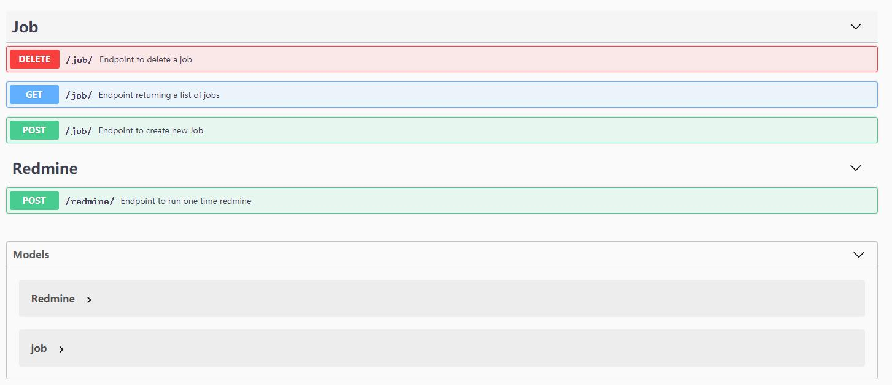

# redmine-ops
自动回复redmine工单   
api list:

api传参说明：  
参数|说明
--|:--:
redminename|redmine中assigned_to的name,如"Lu jin"
username|redmine 账户
username|redmine 密码
job_id|定时任务的id
notes|回复工单的内容，如 "您好，工单已经收到，正在处理中"
time|定时任务的时间，单位为秒

swagger地址 : ip:5000/apidocs
